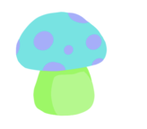

# Hi, I'm Naomi ✨

I'm a full-stack web developer with over 10 years of experience building beautiful, interactive websites. I've worked extensively with HTML, CSS, and Javascript, and lately I've been diving deep into web app development with React and Node.js. I code primarily for fun, to challenge myself, and to master new and exciting technologies, but I'm deeply interested in using tech to benefit people and would love to start getting involved in projects that have purpose, meaning, and potential. 🌎

## Fun facts 🦄

- I started coding [on Neopets](https://variety.com/2017/gaming/features/neopets-internet-girl-culture-1202897761/) at the age of 10
- I was once on German Nickelodeon
- I'm really into ancient life and have a sweet trilobite collection

## Find me online 🔮

- Portfolio: https://ngw.dev/
- Email me: contact@ngw.dev
